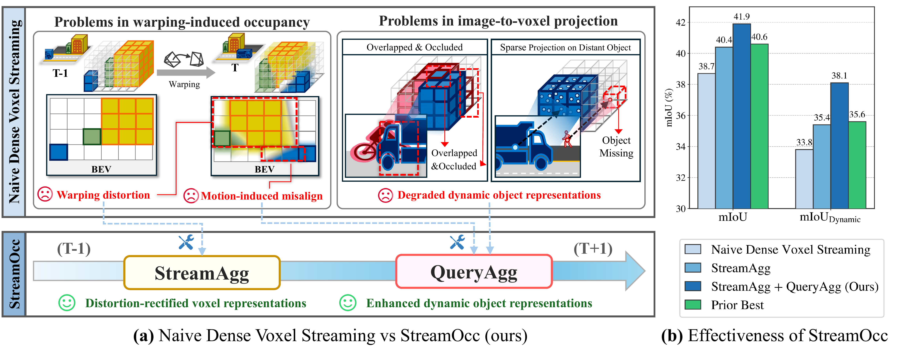

<div align="center">

# StreamOcc

## Streaming Dense Voxel Representations for 3D Occupancy Prediction

[**Seokha Moon**](https://moonseokha.github.io)<sup>1,5,†</sup> ·
[**Janghyun Baek**](https://scholar.google.com/citations?user=UJR1YYQAAAAJ&hl=en)<sup>1</sup> ·
[**Yujin Jeong**](https://eugene6923.github.io/)<sup>2</sup> ·
[**Daewon Chae**](https://daewon88.github.io/)<sup>3</sup> ·
[**Giseop Kim**](https://gisbi-kim.github.io/)<sup>4,5,‡</sup> ·
[**Jungbeom Lee**](https://visionai.korea.ac.kr/)<sup>1</sup> ·
[**Jinkyu Kim**](https://visionai.korea.ac.kr/team/jinkyu_kim)<sup>1,&ast;</sup> ·
[**Sunwook Choi**](https://scholar.google.com/citations?user=R3W7dTsAAAAJ&hl=en)<sup>5,&ast;</sup>

<sup>1</sup>Korea University ·
<sup>2</sup>TU Darmstadt & hessian.AI ·
<sup>3</sup>University of Michigan ·
<sup>4</sup>DGIST ·
<sup>5</sup>NAVER LABS

<sup>†</sup>Work done during an internship at NAVER LABS ·
<sup>‡</sup>Work done while at NAVER LABS

<sup>&ast;</sup> Corresponding authors

[](https://moonseokha.github.io/StreamOcc/)
[](https://eccv.ecva.net/)
[](https://arxiv.org/abs/2503.22087)

</div>

## 🚀 News
- **2026.06.18** — StreamOcc has been accepted to **ECCV 2026**.
- **2025.11.29** — Code released.
- **2025.11.27** — StreamOcc paper has been updated on **[arXiv](https://arxiv.org/abs/2503.22087)**.

## Overview

StreamOcc is an ECCV 2026 real-time 3D occupancy prediction framework that streams dense voxel representations across time. It addresses two key failure modes of naive dense voxel streaming: warping distortion from temporal alignment and degraded dynamic-object representations from image-to-voxel projection.

<p align="center">
  
</p>

## ✨ Highlights
- **StreamOcc** introduces a **dual aggregation strategy** combining *StreamAgg* for temporal dense voxel accumulation and *QueryAgg* for targeted dynamic-object refinement.
- Achieves **state-of-the-art performance**:
  - **Occ3D-nuScenes**: 41.9 mIoU (**+2.3** over prior SOTA / in real-time setting)
  - **SurroundOcc benchmark**: 23.4 mIoU
  - **RayIoU**: 41.1
- Runs within real-time constraints (**83.3 ms**) and requires only **2.8 GB** of GPU memory.


## 💡 Method


StreamOcc predicts voxel occupancy in a streaming manner through two complementary aggregation stages:

### StreamAgg: Rectified Voxel Streaming Aggregation
- Propagates dense voxel features through a recurrent streaming buffer.
- Aligns past voxel features to the current ego frame using motion-aware warping.
- Rectifies interpolation artifacts with adaptive residual refinement.

### QueryAgg: Query-Guided Aggregation
- Extracts instance-level dynamic-object semantics from image features.
- Propagates object queries over time and injects them into corresponding occupied voxel regions.
- Complements dense voxel streaming for distant, occluded, and overlapping dynamic objects.

**StreamAgg and QueryAgg jointly produce a fast, memory-efficient, and high-fidelity 3D occupancy representation.**

## 🎨 Qualitative Results

<p align="center">
  
</p>

StreamOcc provides clearer and more consistent 3D occupancy predictions, significantly improving reconstruction of both dynamic objects and fine-grained static structures compared to prior methods.

## 📊 Quantitative Results
<p align="center">
  
</p>
<p align="center">
  
</p>

StreamOcc achieves state-of-the-art performance on Occ3D-nuScenes (**41.9 mIoU**), the SurroundOcc benchmark (**23.4 mIoU**), and RayIoU (**41.1**), while running at **83.3 ms** and using only **2.8 GB** of memory.

## 🔧 Getting Started
**Step 1.** Set up the environment:  
➡️ [`Install`](docs/install.md)

**Step 2.** Prepare datasets and PKL files:  
➡️ [`Prepare Data`](docs/prepare_data.md)

## 🏋️ Training & Inference

```bash
# Train
bash local_train.sh StreamOcc
# Test
bash local_test.sh StreamOcc path/to/checkpoint
```

## 🙏 Acknowledgement
This project is not possible without multiple great open-sourced code bases. We list some notable examples below.
- [open-mmlab](https://github.com/open-mmlab)
- [Occ3D](https://github.com/Tsinghua-MARS-Lab/Occ3D)
- [BEVDet](https://github.com/HuangJunJie2017/BEVDet)
- [SurroundOcc](https://github.com/weiyithu/SurroundOcc)
- [FB-OCC](https://github.com/NVlabs/FB-BEV)
- [Sparse4D](https://github.com/HorizonRobotics/Sparse4D)


## 📃 Bibtex
If this work is helpful for your research, please consider citing the following BibTeX entry.
```
@article{moon2025streamocc,
  title={Streaming Dense Voxel Representations for 3D Occupancy Prediction},
  author={Moon, Seokha and Baek, Janghyun and Jeong, Yujin and Chae, Daewon and Kim, Giseop and Lee, Jungbeom and Kim, Jinkyu and Choi, Sunwook},
  journal={arXiv preprint arXiv:2503.22087},
  year={2025}
}
```
